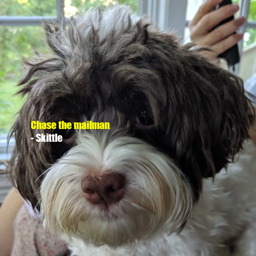
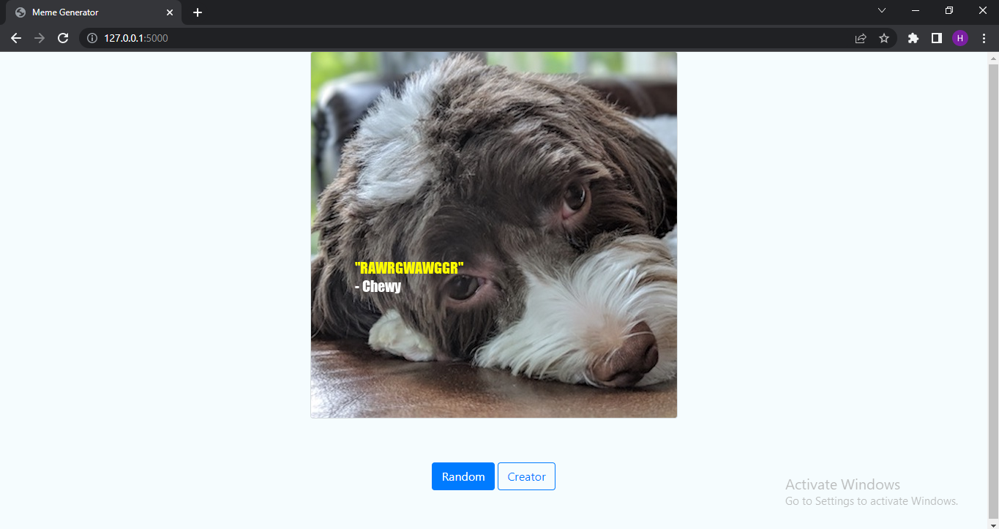
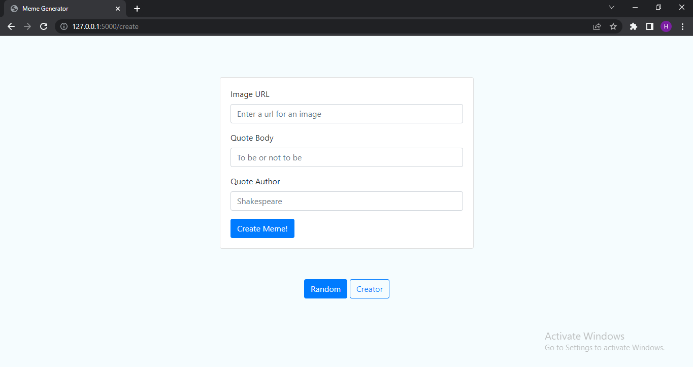

# Meme Generator
Generating a memes by stacking quotes over images.




## Overview and Modules
The project driving executors are:
- The Quote Engine that collects quotes from multiple file types and return quote details as a Quote Object.
- The Meme Engine that takes a random Quote objects and stacks its details on an image.
- The user can provide his own custom meme image and quote and a meme will be created via a CLI (command line interface) or a web service app.

## Setup
To set up the project we need the following:
1. Clone the repo on your local machine by running the command:
```
git clone 
```

2. Install the xpdf tool on your system by [downloading](https://www.xpdfreader.com/download.html) the proper version for it and adding the path for the proper bin file to your system environment varibles. This is to collect quotes from PDF files.

3. Create a new python environment for the project by running one of the following commands on your terminal (assuming windows).
```
python -m venv .memeenv
```
```
conda create --name .memeenv python=3.9.12
```

4. Activate your environment by running one of the following commands in your terminal.
```
./.memeenv/Scripts/activate.bat
```
```
conda activate .memeenv
```

5. Install the required packages by running the following command:
```
pip install -r requirements.txt
```


## Terminal Examples
Once all the setup is done, you can run the follwing example in your terminal
```
python meme.py
```
and it will generate a random meme for you.

You can also generate your custom meme but you need to understand how to do it in the terminal first. You can run
```
python meme.py -h
```
and it will handle your needs.


## Webpage Examples
You can also use the interactive webpage interface to generate a random meme or your custom one.


---


## Credit
[Udacity](https://www.googleadservices.com/pagead/aclk?sa=L&ai=DChcSEwjI6rHVv9_5AhULkGgJHePzDC4YABAAGgJ3Zg&ohost=www.google.com&cid=CAESbOD2X_Deqki3DVknwEN_wJZulHCknGi-xQE-yritHSFWwD2THicTwXeyvEFMpSbF8d_Z8yCokn9EnrG06hTH88tWnphCj4fJN45qvCBBpNn2isRZbpNYhz-yKWyfhRFmpCPQKpCBq29i62mVdQ&sig=AOD64_3oTrFmo3L5pfXO6fWaknAZIvodHw&q&adurl&ved=2ahUKEwif76jVv9_5AhUPfBoKHR7XCAYQ0Qx6BAgCEAE)